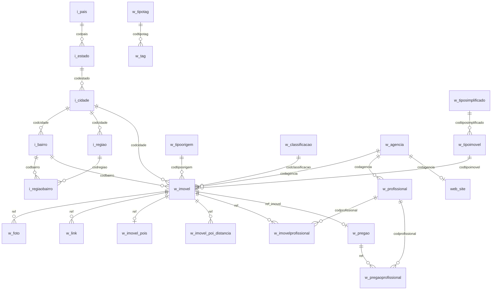

# Manual Técnico — Banco de Dados de Carga do Site

> Gerado a partir de `SiteResource.php` (portal_id = 1)  
> Charset padrão: **latin1** | Engine padrão: **MyISAM** (fallback: InnoDB)

---

## 1. Visão Geral

O **banco de carga** é um banco MySQL separado do banco principal do sistema Nido. Ele é populado pelo processo de exportação (`SiteResource`) e consumido pelo site da imobiliária. A separação garante que o site leia dados já consolidados, sem acessar o banco transacional do sistema.

### 1.1 Fluxo de execução

```
Sistema Nido (banco principal)
        │
        ▼
  SiteResource::beforeSend()
        │  ├─ prepareTables()      → cria/atualiza estrutura no banco carga
        │  └─ verifica carga vazia
        ▼
  SiteResource::send()
        │  ├─ getPublished()       → carrega snapshot atual do banco carga
        │  ├─ compara timestamps   → decide inserir / atualizar / pular / remover
        │  ├─ monta lotes de 100   → DELETE dependentes + REPLACE INTO
        │  └─ completeTables()     → popula tabelas auxiliares e limpa órfãos
        ▼
  Banco de Carga (site)
```

### 1.2 Estratégia de atualização (diff incremental)

Para cada imóvel na lista de carga, o sistema compara **8 marcadores** com o snapshot armazenado em `w_imovel`:

| Índice | Campo comparado | Significado |
|--------|----------------|-------------|
| [0] | `dataatualizacao` | Data de alteração dos dados do imóvel |
| [1] | `dataalteracaofoto` | Data da última alteração de foto da unidade |
| [2] | `dataalteracaofoto_empreendimento` | Data da última alteração de foto do empreendimento |
| [3] | `situacao` (quota da regra) | Status de publicação (ex: 1 = ativo) |
| [4] | `imovel_desabilitado` | Flag de desativação manual |
| [5] | `regra_sistema` | Código da regra de carga aplicada |
| [6] | contagem de fotos em `w_foto` | Garante reprocessamento se fotos foram adicionadas/removidas |
| [7] | `dataatualizacao_pregao` | Data do último pregão associado |

Se todos os 8 marcadores baterem, o imóvel é **pulado**. Qualquer divergência dispara atualização completa do registro e seus dependentes.

### 1.3 Controle de migração de schema

A tabela `nido_migration` armazena um hash SHA1 do array `$tablesSchema`. A cada execução, o hash atual é comparado ao armazenado. Se diferir, a estrutura de todas as tabelas é recriada/atualizada via `ALTER TABLE ADD COLUMN` sem destruir dados.

---

## 2. Dicionário de Dados

### 2.1 Tabelas de Imóvel

---

#### `w_imovel` — Imóveis publicados (tabela principal)

Contém um registro por imóvel publicado no site. É populada com `REPLACE INTO` (upsert).

| Coluna | Tipo | Nulo | Descrição |
|--------|------|------|-----------|
| `ref` | varchar(16) | NOT NULL | **PK.** Referência única do imóvel (concatenação de agência + código) |
| `dataatualizacao` | datetime | SIM | Data/hora da última alteração dos dados no sistema |
| `datacadastro` | datetime | SIM | Data de cadastro original do imóvel |
| `dataalteracaofoto` | datetime | SIM | Data da última alteração de foto da unidade |
| `dataalteracaofoto_empreendimento` | datetime | SIM | Data da última alteração de foto do empreendimento |
| `dataatualizacao_pregao` | datetime | SIM | Data do último pregão vinculado |
| `datahora_pub` | datetime | SIM | Data/hora em que este registro foi publicado no banco de carga |
| `codagencia` | varchar(2) | SIM | Código da agência **proprietária** do imóvel |
| `codagencia_publicacao` | varchar(2) | SIM | Código da agência que realizou a publicação |
| `codtipoimovel` | int(11) | SIM | FK → `w_tipoimovel.codtipoimovel` |
| `codtiposimplificado` | int(11) | SIM | FK → `w_tiposimplificado.codtiposimplificado` |
| `tipoimovel` | varchar(64) | SIM | Descrição textual do tipo (desnormalizado para performance) |
| `tiposimplificado` | varchar(64) | SIM | Descrição do tipo simplificado (desnormalizado) |
| `codtiponegocio` | varchar(1) | SIM | `V` = Venda · `L` = Locação |
| `codtipoutilizacao` | char(1) | SIM | `R` = Residencial · `C` = Comercial · `I` = Industrial · `U` = Rural · `X` = Misto |
| `residencial` | char(1) | SIM | `S`/`N` — flag para uso residencial |
| `comercial` | char(1) | SIM | `S`/`N` — flag para uso comercial |
| `rural` | char(1) | SIM | `S`/`N` — flag para uso rural |
| `industrial` | char(1) | SIM | `S`/`N` — flag para uso industrial |
| `codtipoorigem` | int(11) | SIM | FK → `w_tipoorigem.codtipoorigem` |
| `lancamento` | int(1) | SIM | Sempre `0` neste portal (campo reservado) |
| `cep` | varchar(8) | SIM | CEP sem formatação |
| `logradouro` | varchar(25) | SIM | Tipo do logradouro (ex: Rua, Av.) |
| `endereco` | varchar(512) | SIM | Endereço completo (rua + número) |
| `numero` | blob | SIM | Número do imóvel (blob para suportar valores como "S/N") |
| `complemento` | varchar(150) | SIM | Complemento do endereço |
| `codcidade` | int(11) | SIM | FK → `i_cidade.codcidade` |
| `cidade` | varchar(64) | SIM | Nome da cidade (desnormalizado) |
| `estado` | char(2) | SIM | Sigla do estado (ex: SP) |
| `codbairro` | int(10) | SIM | FK → `i_bairro.codbairro` |
| `bairro` | varchar(72) | SIM | Nome do bairro (desnormalizado, sem parênteses e pontos) |
| `regiao` | varchar(72) | SIM | Descrição da região principal do bairro |
| `codregiao1` | varchar(72) | SIM | Região principal (mesmo que `regiao`) |
| `codregiao2` | varchar(72) | SIM | Região secundária (uso futuro) |
| `codregiao3` | varchar(72) | SIM | Região terciária (uso futuro) |
| `latitude` | double | SIM | Coordenada geográfica — latitude |
| `longitude` | double | SIM | Coordenada geográfica — longitude |
| `valor` | double | SIM | Valor principal: `valorvenda` se disponível, senão `valorlocacao` |
| `disponivelvenda` | tinyint(1) | SIM | `1` = disponível para venda |
| `valorvenda` | double | NOT NULL | Valor de venda (0 se não disponível) |
| `valorvendam2` | float | SIM | Valor de venda por m² |
| `disponivellocacao` | tinyint(1) | SIM | `1` = disponível para locação |
| `valorlocacao` | double | NOT NULL | Valor de locação (0 se não disponível) |
| `periodolocacao` | varchar(32) | SIM | Período de locação (ex: mensal, anual) |
| `valorlocacaom2` | float | SIM | Valor de locação por m² |
| `disponiveltemporada` | tinyint(1) | SIM | `1` = disponível para temporada |
| `valortemporada` | double | SIM | Valor para locação por temporada |
| `qtdepessoas` | int(11) | SIM | Capacidade de pessoas (temporada) |
| `qtdelevadores` | int(11) | SIM | Quantidade de elevadores |
| `condominio` | double | SIM | Valor do condomínio |
| `iptu` | double | SIM | Valor do IPTU (NULL se isento) |
| `tipoiptu` | varchar(10) | SIM | Tipo/periodicidade do IPTU |
| `dormitorios` | smallint(6) | SIM | Quantidade de dormitórios |
| `suites` | smallint(6) | SIM | Quantidade de suítes |
| `vagas` | smallint(6) | SIM | Quantidade de vagas de garagem |
| `salas` | smallint(6) | SIM | Quantidade de salas |
| `banheiros` | int(11) | SIM | Quantidade de banheiros |
| `areatotal` | int(11) | SIM | Área total do terreno (m²) |
| `areautil` | int(11) | SIM | Área útil construída (m²) |
| `metragem` | varchar(20) | SIM | Metragem em texto formatado |
| `titulo` | text | SIM | Título promocional do imóvel |
| `promocao` | text | SIM | Texto de descrição/promoção para o site (pode ter texto extra concatenado via config) |
| `detunidade` | text | SIM | Características da unidade em texto (ex: "Piscina, Academia") |
| `detcondominio` | text | SIM | Características do condomínio em texto |
| `caracteristica_unidade` | varchar(2048) | SIM | Códigos de características da unidade no formato `/cod1/cod2/` |
| `caracteristica_condominio` | varchar(2048) | SIM | Códigos de características do condomínio no formato `/cod1/cod2/` |
| `tag` | text | SIM | Tags associadas no formato `/tag1/tag2/` |
| `comfoto` | tinyint(1) | SIM | `1` = tem fotos |
| `quantidade_fotos` | int(10) | SIM | Número de fotos públicas |
| `comtexto` | tinyint(1) | SIM | `1` = tem texto de descrição |
| `comfinanciamento` | tinyint(1) | SIM | `1` = aceita financiamento |
| `valorentrada` | double | SIM | Valor de entrada do financiamento |
| `valorparcela` | double | SIM | Valor da parcela do financiamento |
| `condpagamento` | text | SIM | Texto livre de condições de pagamento |
| `situacao` | int(1) | SIM | Status de publicação (espelha `quota` da regra de carga) |
| `situacao_imovel` | varchar(20) | SIM | Descrição da situação do imóvel (ex: "Pronto para Morar") |
| `empreendimento` | varchar(150) | SIM | Nome do empreendimento/condomínio |
| `edificio` | varchar(150) | SIM | Nome do edifício |
| `imediacoes` | varchar(50) | SIM | Referência de imediações |
| `video` | varchar(1024) | SIM | URLs de vídeo no formato `[url1][url2]` (convertidas para embed) |
| `zoneamento` | varchar(32) | SIM | Zoneamento urbanístico |
| `situacao_mobilia` | varchar(32) | SIM | Situação da mobília (ex: Mobiliado, Semi-mobiliado) |
| `codigo_anterior` | varchar(20) | SIM | Código anterior do imóvel (migração de sistemas legados) |
| `textoimpressao` | varchar(2048) | SIM | Texto para impressão de ficha |
| `codprofissional` | varchar(6) | SIM | Código do profissional principal |
| `codclassificacao` | int(3) | SIM | FK → `w_classificacao.codclassificacao` |
| `exclusividade` | tinyint(1) | SIM | `1` = imóvel exclusivo |
| `plantao` | tinyint(1) | SIM | `1` = imóvel com plantão de vendas |
| `remanescente` | tinyint(1) | SIM | `1` = unidade remanescente de lançamento |
| `aceitapermuta` | tinyint(1) | SIM | `1` = aceita permuta |
| `possuirenda` | tinyint(1) | SIM | `1` = imóvel com renda (investimento) |
| `regra_sistema` | varchar(3) | SIM | Código da regra de carga que selecionou este imóvel |
| `imovel_desabilitado` | tinyint(1) | SIM | `1` = imóvel desabilitado manualmente (default: 0) |

**Índices:** `codtipoimovel`, `codclassificacao`, `codtipoorigem`, `disponivelvenda`, `disponivellocacao`, `codbairro`, `codigo_anterior`, `situacao`, `datacadastro`

**Observações de negócio:**
- Quando a config de carga tem `negocio = 'venda'`, `disponivellocacao` e `valorlocacao` são zerados. O inverso vale para `negocio = 'locacao'`.
- `bairro`, `regiao` e `codregiao1` passam por limpeza de caracteres `( ) .` no `completeTables()`.

---

#### `w_foto` — Fotos dos imóveis

| Coluna | Tipo | Nulo | Descrição |
|--------|------|------|-----------|
| `ref` | varchar(16) | NOT NULL | **PK (parte 1).** FK → `w_imovel.ref` |
| `seq` | int(11) | NOT NULL | **PK (parte 2).** Ordem/sequência da foto (0-based) |
| `titulo` | varchar(30) | SIM | Legenda da foto |
| `foto` | longblob | SIM | URL da foto (armazenado como texto em blob, convertido para HTTPS) |
| `destaque` | tinyint(1) | SIM | `1` = foto de destaque |

**Índice:** `ref`

**Observação:** As URLs passam pela função `parseHttps()`: URLs `http://static.nidoimovel` são convertidas para `https://s3.amazonaws.com/`; URLs `http://static2.nidoimovel` para `https://storage.googleapis.com/`.

---

#### `w_link` — Links associados ao imóvel

| Coluna | Tipo | Nulo | Descrição |
|--------|------|------|-----------|
| `ref` | varchar(16) | NOT NULL | **PK (parte 1).** FK → `w_imovel.ref` |
| `ordem` | int(11) | NOT NULL | **PK (parte 2).** Ordem de exibição |
| `titulo` | varchar(64) | SIM | Descrição/título do link |
| `tipo` | varchar(64) | SIM | Tipo do link (ex: "Tour Virtual", "Planta") |
| `url` | varchar(20148) | SIM | URL completa |

**Índice:** `ref`

---

### 2.2 Tabelas de Localização

---

#### `i_bairro` — Bairros

| Coluna | Tipo | Nulo | Descrição |
|--------|------|------|-----------|
| `codbairro` | int(11) | NOT NULL | **PK** |
| `codcidade` | int(11) | NOT NULL | FK → `i_cidade.codcidade` |
| `maxcep` | varchar(8) | SIM | CEP máximo do bairro (range) |
| `descricao` | varchar(72) | SIM | Nome original do bairro |
| `nomeuso` | varchar(72) | SIM | Nome de uso (sem `( ) .`, usado na exibição no site) |
| `situacao` | varchar(10) | SIM | `Ativo` / `Cancelado` |

**Observação:** `nomeuso` é normalizado no `completeTables()` via `TRIM(REPLACE(...))`.

---

#### `i_cidade` — Cidades

| Coluna | Tipo | Nulo | Descrição |
|--------|------|------|-----------|
| `codcidade` | int(11) | NOT NULL | **PK** |
| `codestado` | int(11) | NOT NULL | FK → `i_estado.codestado` |
| `descricao` | varchar(50) | SIM | Nome da cidade |
| `cep` | varchar(8) | SIM | CEP representativo da cidade |
| `situacao` | varchar(10) | SIM | `Ativo` / `Cancelado` |
| `siglaestado` | varchar(2) | SIM | Sigla do estado (desnormalizado) |
| `imovel` | tinyint(1) | SIM | `1` = cidade com imóveis cadastrados |

---

#### `i_estado` — Estados

| Coluna | Tipo | Nulo | Descrição |
|--------|------|------|-----------|
| `codestado` | int(11) | NOT NULL | **PK** |
| `codpais` | int(11) | NOT NULL | FK → `i_pais.codpais` |
| `descricao` | varchar(50) | SIM | Nome do estado |
| `sigla` | varchar(2) | SIM | Sigla (ex: SP, RJ) |
| `situacao` | varchar(10) | SIM | `Ativo` / `Cancelado` |

---

#### `i_pais` — Países

| Coluna | Tipo | Nulo | Descrição |
|--------|------|------|-----------|
| `codpais` | int(11) | NOT NULL | **PK** |
| `descricao` | varchar(50) | SIM | Nome do país |
| `situacao` | varchar(10) | SIM | `Ativo` / `Cancelado` |

**Observação:** Populado automaticamente sempre que há estados na carga (`i_pais` é dependente de `i_estado`).

---

#### `i_regiao` — Regiões / Zonas

| Coluna | Tipo | Nulo | Descrição |
|--------|------|------|-----------|
| `codregiao` | int(11) | NOT NULL | **PK** |
| `codcidade` | int(11) | NOT NULL | FK → `i_cidade.codcidade` |
| `macrozona` | varchar(20) | SIM | Agrupamento de macrozona (ex: Zona Norte) |
| `zona` | varchar(20) | SIM | Zona menor (ex: Santana) |
| `descricao` | varchar(50) | SIM | Nome da região |
| `situacao` | varchar(10) | SIM | `Ativo` / `Cancelado` |

**Índice único:** `(codcidade, descricao)`

---

#### `i_regiaobairro` — Relacionamento Região × Bairro

| Coluna | Tipo | Nulo | Descrição |
|--------|------|------|-----------|
| `codregiao` | int(11) | NOT NULL | **PK (parte 1).** FK → `i_regiao.codregiao` |
| `codbairro` | int(11) | NOT NULL | **PK (parte 2).** FK → `i_bairro.codbairro` |
| `situacao` | varchar(10) | SIM | `Ativo` / `Cancelado` |

**Índice:** `codbairro`

**Observação:** Esta tabela é **sempre truncada** (`DELETE FROM i_regiaobairro`) antes de cada recarga, garantindo que o relacionamento reflita o estado atual do sistema.

---

### 2.3 Tabelas de Classificação e Tipos

---

#### `w_tipoimovel` — Tipos de imóvel

| Coluna | Tipo | Nulo | Descrição |
|--------|------|------|-----------|
| `codtipoimovel` | int(11) | NOT NULL | **PK** |
| `descricao` | varchar(50) | SIM | Nome completo (ex: Apartamento) |
| `descricao_slug` | varchar(50) | SIM | Versão slug para URL (ex: apartamento) |
| `codtiposimplificado` | int(10) | SIM | FK → `w_tiposimplificado.codtiposimplificado` |
| `validacao` | char(1) | SIM | Regra de validação do tipo |
| `situacao` | varchar(10) | SIM | `Ativo` / `Cancelado` |
| `publicavel` | tinyint(4) | SIM | `1` = pode ser publicado no site |

---

#### `w_tiposimplificado` — Tipos simplificados de imóvel

| Coluna | Tipo | Nulo | Descrição |
|--------|------|------|-----------|
| `codtiposimplificado` | int(10) | NOT NULL | **PK** |
| `descricao` | varchar(50) | SIM | Nome (ex: Residencial, Comercial) |
| `descricao_slug` | varchar(50) | SIM | Versão slug para URL |
| `situacao` | varchar(10) | SIM | `Ativo` / `Cancelado` |

---

#### `w_tipoorigem` — Tipos de origem do imóvel

| Coluna | Tipo | Nulo | Descrição |
|--------|------|------|-----------|
| `codtipoorigem` | int(10) | NOT NULL | **PK** |
| `descricao` | varchar(50) | SIM | Ex: Captação, Parceria, Chave na Mão |
| `situacao` | varchar(10) | SIM | `Ativo` / `Cancelado` |

---

#### `w_classificacao` — Classificações de imóvel

| Coluna | Tipo | Nulo | Descrição |
|--------|------|------|-----------|
| `codclassificacao` | int(11) | NOT NULL | **PK** |
| `descricao` | varchar(100) | SIM | Ex: Alto Padrão, Econômico |
| `situacao` | varchar(10) | SIM | `Ativo` / `Cancelado` |

---

### 2.4 Tabelas de Tags

---

#### `w_tag` — Tags

| Coluna | Tipo | Nulo | Descrição |
|--------|------|------|-----------|
| `codtag` | int(11) | NOT NULL | **PK** |
| `codtipotag` | int(11) | NOT NULL | FK → `w_tipotag.codtipotag` |
| `titulo` | varchar(100) | SIM | Nome da tag |
| `descricao` | text | SIM | Descrição longa |
| `palavras_chave` | text | SIM | Palavras-chave para SEO |
| `slug` | varchar(100) | SIM | Versão slug para URL |
| `situacao` | varchar(10) | SIM | `Ativo` / `Cancelado` |

---

#### `w_tipotag` — Tipos de tag

| Coluna | Tipo | Nulo | Descrição |
|--------|------|------|-----------|
| `codtipotag` | int(11) | NOT NULL | **PK** |
| `descricao` | text | SIM | Descrição do tipo de tag |
| `slug` | varchar(100) | SIM | Versão slug para URL |
| `situacao` | varchar(10) | SIM | `Ativo` / `Cancelado` |

---

### 2.5 Tabelas de Profissionais e Agências

---

#### `w_profissional` — Corretores / Profissionais

| Coluna | Tipo | Nulo | Descrição |
|--------|------|------|-----------|
| `codagencia` | varchar(2) | NOT NULL | Agência do profissional |
| `codprofissional` | varchar(6) | NOT NULL | **PK** |
| `nomeuso` | varchar(40) | SIM | Nome de exibição |
| `nivel` | varchar(40) | SIM | Descrição do nível de acesso |
| `foto` | mediumblob | SIM | URL da foto (blob; URLs `s3://` convertidas para `https://s3.amazonaws.com/`) |
| `obs` | text | SIM | Observações internas |
| `ddd1` | varchar(3) | SIM | DDD do telefone 1 (NULL se `tel_exibesite = false`) |
| `fone1` | varchar(10) | SIM | Telefone 1 (NULL se `tel_exibesite = false`) |
| `ddd2` | varchar(3) | SIM | DDD do telefone 2 (NULL se `tel2_exibesite = false`) |
| `fone2` | varchar(10) | SIM | Telefone 2 (NULL se `tel2_exibesite = false`) |
| `email1` | varchar(50) | SIM | E-mail principal |
| `email2` | varchar(50) | SIM | E-mail secundário |
| `email3` | varchar(50) | SIM | E-mail terciário |
| `dddcelular` | varchar(3) | SIM | DDD do celular (NULL se `cel_exibesite = false`) |
| `celular` | varchar(10) | SIM | Celular (NULL se `cel_exibesite = false`) |
| `codequipe` | int(3) | SIM | Código da equipe |
| `equipenome` | varchar(50) | SIM | Nome da equipe (desnormalizado; "Sem Equipe" se não houver) |
| `nextel_id` | varchar(20) | SIM | ID Nextel (legado) |
| `creci` | varchar(10) | SIM | Número do CRECI |
| `ramal` | varchar(5) | SIM | Ramal telefônico |
| `idiomas` | varchar(50) | SIM | Idiomas que o profissional fala |

**Observações:**
- Profissionais com `situacao = 'Cancelado'` são **deletados** de `w_profissional` e `w_imovelprofissional` no `completeTables()`.
- Quando `sys_configuration::test('envia_profissionais_site')` está ativo, **todos** os profissionais ativos são enviados, não apenas os vinculados a imóveis.
- Contatos (telefones/celular) só são enviados se as flags `tel_exibesite`, `tel2_exibesite`, `cel_exibesite` estiverem ativas no cadastro do profissional.

---

#### `w_agencia` — Agências/Filiais

| Coluna | Tipo | Nulo | Descrição |
|--------|------|------|-----------|
| `codagencia` | varchar(2) | NOT NULL | **PK** |
| `nomeempresa` | varchar(50) | SIM | Nome fantasia |
| `nome` | varchar(50) | SIM | Nome curto |
| `razaosocial` | varchar(70) | SIM | Razão social |
| `cep` | varchar(8) | SIM | CEP |
| `endereco` | varchar(70) | SIM | Logradouro |
| `numero` | int(11) | SIM | Número |
| `bairro` | varchar(50) | SIM | Bairro |
| `complemento` | varchar(50) | SIM | Complemento |
| `cidade` | varchar(50) | SIM | Cidade |
| `estado` | varchar(2) | SIM | Estado |
| `ddd1` | varchar(2) | SIM | DDD do telefone 1 |
| `telefone1` | varchar(10) | SIM | Telefone 1 |
| `ddd2` | varchar(2) | SIM | DDD do telefone 2 |
| `telefone2` | varchar(10) | SIM | Telefone 2 |
| `dddfax` | varchar(2) | SIM | DDD do fax |
| `fax` | varchar(10) | SIM | Número do fax |
| `email` | varchar(50) | SIM | E-mail |
| `creci` | varchar(20) | SIM | CRECI da agência |
| `situacao` | varchar(10) | SIM | `Ativo` / `Cancelado` |

---

#### `w_imovelprofissional` — Vínculo Imóvel × Profissional

| Coluna | Tipo | Nulo | Descrição |
|--------|------|------|-----------|
| `ref` | varchar(16) | NOT NULL | **PK (parte 1).** FK → `w_imovel.ref` |
| `relacao` | varchar(60) | NOT NULL | **PK (parte 2).** Tipo de relação (ex: Captador, Responsável) |
| `codprofissional` | varchar(20) | NOT NULL | **PK (parte 3).** FK → `w_profissional.codprofissional` |
| `codprofagencia` | varchar(20) | SIM | Agência do profissional neste vínculo |
| `codprofequipe` | varchar(20) | SIM | Equipe do profissional neste vínculo |
| `ordem` | int(11) | SIM | Ordem de exibição |

**Índice:** `ref`

**Observação:** Apenas profissionais com `situacao = 'Ativo'` são incluídos.

---

### 2.6 Tabelas de Pregão (Leilão)

---

#### `w_pregao` — Pregões / Leilões

| Coluna | Tipo | Nulo | Descrição |
|--------|------|------|-----------|
| `ref` | varchar(16) | NOT NULL | **PK.** Referência do pregão |
| `ref_imovel` | varchar(13) | NOT NULL | FK → `w_imovel.ref` |
| `tipo_negocio` | varchar(10) | SIM | Tipo de negócio do pregão (ex: Venda) |
| `valorpregao` | double | SIM | Lance mínimo |
| `texto` | text | SIM | Descrição/condições do pregão |
| `datahora` | datetime | SIM | Data/hora do pregão |
| `validade` | datetime | SIM | Data de validade do pregão |

---

#### `w_pregaoprofissional` — Profissionais do Pregão

| Coluna | Tipo | Nulo | Descrição |
|--------|------|------|-----------|
| `ref` | varchar(16) | NOT NULL | **PK.** FK → `w_pregao.ref` |
| `codprofissional` | varchar(20) | NOT NULL | FK → `w_profissional.codprofissional` |
| `codprofagencia` | varchar(20) | SIM | Agência do profissional no pregão |
| `codprofequipe` | varchar(20) | SIM | Equipe do profissional no pregão |

---

### 2.7 Tabelas de POI (Points of Interest) — Módulo Iconatus

Estas tabelas só são populadas quando o marketplace **Iconatus** está ativo.

---

#### `w_imovel_pois` — POIs do imóvel (consolidado)

| Coluna | Tipo | Nulo | Descrição |
|--------|------|------|-----------|
| `ref` | varchar(16) | NOT NULL | **PK.** FK → `w_imovel.ref` |
| `pois` | blob | SIM | JSON com todos os pontos de interesse |

**Observação:** Truncada via `DELETE FROM w_imovel_pois` quando Iconatus não está ativo.

---

#### `w_imovel_poi_distancia` — Distâncias de POI

| Coluna | Tipo | Nulo | Descrição |
|--------|------|------|-----------|
| `ref` | varchar(16) | NOT NULL | **PK (parte 1).** FK → `w_imovel.ref` |
| `tipo` | varchar(48) | NOT NULL | **PK (parte 2).** Tipo do POI (ex: escola, hospital) |
| `nome` | varchar(72) | NOT NULL | **PK (parte 3).** Nome do estabelecimento |
| `distancia` | double | SIM | Distância em metros |

**Índices:** `ref`, `tipo`, `nome`, `(tipo, nome)`

---

### 2.8 Tabelas de Leads e Comunicação

---

#### `w_lead` — Leads recebidos pelo site

Gravados pelo site; **lidos** pelo sistema Nido para processamento. O sentido de escrita é **inverso** às demais tabelas.

| Coluna | Tipo | Nulo | Descrição |
|--------|------|------|-----------|
| `id` | int(11) AUTO_INCREMENT | NOT NULL | **PK** |
| `tipo_lead` | enum('Unidade','Empreendimento') | NOT NULL | Tipo do lead (default: Unidade) |
| `referencia` | char(50) | SIM | Referência do imóvel de interesse |
| `codagencia_publicacao` | varchar(2) | SIM | Agência publicadora do imóvel |
| `tipoimovel` | int(11) | SIM | Tipo de imóvel de interesse |
| `codtipoutilizacao` | char(1) | SIM | Utilização desejada (R/C/I/U/X) |
| `codregiao` | varchar(72) | SIM | Região de interesse |
| `disponivelvenda` | tinyint(4) | SIM | `1` = interessa venda |
| `valorvenda` | double | SIM | Faixa de valor para venda |
| `disponivellocacao` | tinyint(4) | SIM | `1` = interessa locação |
| `valorlocacao` | double | SIM | Faixa de valor para locação |
| `cliente` | varchar(100) | SIM | Nome do cliente |
| `email` | varchar(200) | SIM | E-mail do cliente |
| `telefone` | char(20) | SIM | Telefone fixo |
| `celular` | char(20) | SIM | Celular |
| `gostaria_de` | varchar(200) | SIM | Preferência de contato/interesse |
| `tipouso` | varchar(200) | SIM | Tipo de uso desejado |
| `mensagem` | text | SIM | Mensagem livre do cliente |
| `datahora` | datetime | SIM | Data/hora do envio |
| `status` | enum('Pendente','Processado','Erro') | SIM | Status de processamento pelo sistema |
| `data_agendamento` | datetime | SIM | Data/hora de agendamento de visita |

**Índices:** `datahora`, `status`

---

#### `w_comunicacao` — Fila de comunicações

Fila para envio de e-mails, SMS ou outros canais.

| Coluna | Tipo | Nulo | Descrição |
|--------|------|------|-----------|
| `id` | int(11) AUTO_INCREMENT | NOT NULL | **PK** |
| `tipocomunicao` | tinyint(4) | SIM | Código do canal (e-mail, SMS, etc.) |
| `dados_contato` | blob | SIM | Dados serializados/JSON do contato |
| `status` | enum('Pendente','Processado','Erro') | SIM | Status de processamento |
| `datahora` | datetime | SIM | Data/hora do registro |

**Índices:** `datahora`, `status`, `tipocomunicao`

---

### 2.9 Tabelas de Configuração do Site

---

#### `web_site` — Configuração do site da imobiliária

Populada por `populateWebSiteTable()` separadamente do fluxo principal.

| Coluna | Tipo | Nulo | Descrição |
|--------|------|------|-----------|
| `id` | int(11) AUTO_INCREMENT | NOT NULL | **PK** |
| `codagencia` | char(2) | SIM | FK para a agência |
| `modelo_site` | integer | SIM | Identificador do template/modelo do site |
| `texto_home` | mediumtext | SIM | Texto da página inicial |
| `texto_empresa` | mediumtext | SIM | Texto "Sobre a empresa" |
| `texto_faleconosco` | text | SIM | Texto da página de contato |
| `texto_lgpd` | text | SIM | Política de privacidade / LGPD |
| `titulo_home` | varchar(64) | SIM | Título da home |
| `informacoes_principais` | blob | SIM | JSON: endpoint da API e JWT token (Lead API) |
| `endereco` | blob | SIM | JSON com dados de endereço da imobiliária |
| `contatos` | blob | SIM | JSON com telefones, e-mails, redes sociais |
| `informacoes_promocionais` | blob | SIM | JSON com banners e promoções |
| `paginas_extra` | longblob | SIM | JSON com páginas extras configuradas |
| `informacoes_seo` | blob | SIM | JSON com meta tags e dados de SEO |
| `informacoes_google` | blob | SIM | JSON com chaves Google (Analytics, Maps, reCAPTCHA) |
| `informacoes_lais` | blob | SIM | JSON com configuração do módulo LAIS (IA conversacional) |
| `image_path` | varchar(255) | SIM | URL do logo principal |
| `favicon` | varchar(255) | SIM | URL do favicon |
| `banner` | varchar(4092) | SIM | URLs de banners da home |
| `imagem_contato` | varchar(255) | SIM | URL da imagem da página de contato |

**Observação:** URLs de imagens passam por `GerenciaArquivo::isUrl()` antes de ser gravadas.

---

### 2.10 Tabela de Controle Interno

---

#### `nido_migration` — Controle de schema

| Coluna | Tipo | Nulo | Descrição |
|--------|------|------|-----------|
| `id` | int(11) AUTO_INCREMENT | NOT NULL | **PK** |
| `migration` | varchar(255) | SIM | Hash SHA1 do `$tablesSchema` atual |
| `date` | datetime | SIM | Data/hora em que o schema foi aplicado |

**Índice:** `date`

---

## 3. Diagrama de Relacionamentos



---

## 4. Limpeza de Órfãos (completeTables)

Ao final de cada exportação, as seguintes queries de limpeza são executadas em ordem:

| Operação | Critério |
|----------|----------|
| DELETE `w_tipoimovel` | Sem imóvel correspondente em `w_imovel` |
| DELETE `i_bairro` | Sem imóvel correspondente em `w_imovel` |
| DELETE `i_regiaobairro` | Bairro não existe em `i_bairro` |
| DELETE `i_regiao` | Sem `i_regiaobairro` correspondente |
| DELETE `i_cidade` | Sem imóvel correspondente em `w_imovel` |
| DELETE `w_profissional` | Sem vínculo em `w_imovelprofissional` |
| UPDATE `w_profissional` | Converte URLs `s3://` → `https://s3.amazonaws.com/` |
| UPDATE `w_profissional` | Converte URLs `gs://` → `http://` |
| UPDATE `i_bairro.nomeuso` | Remove `( ) .` e espaços extras |
| UPDATE `w_imovel` | Remove `( ) .` de `bairro`, `regiao`, `codregiao1` |

---

## 5. Configurações que Afetam a Exportação

| Configuração | Local | Efeito |
|---|---|---|
| `config_carga['data']['texto_extra']` | `web_config` | Concatena texto adicional ao campo `promocao` |
| `config_carga['data']['texto_extra_negocio']` | `web_config` | Limita o texto_extra a um tipo de negócio |
| `config['negocio']` | Regra de carga | `'venda'` zera locação; `'locacao'` zera venda |
| `config_carga['leadApi']` | `web_config` | Se vazio, limpa `endpoint` e `jwtToken` do `web_site` |
| `sys_configuration::test('envia_profissionais_site')` | Sistema | Força envio de todos os profissionais ativos |
| Marketplace Iconatus ativo | `marketplace` | Habilita envio de `w_imovel_pois` e `w_imovel_poi_distancia` |
